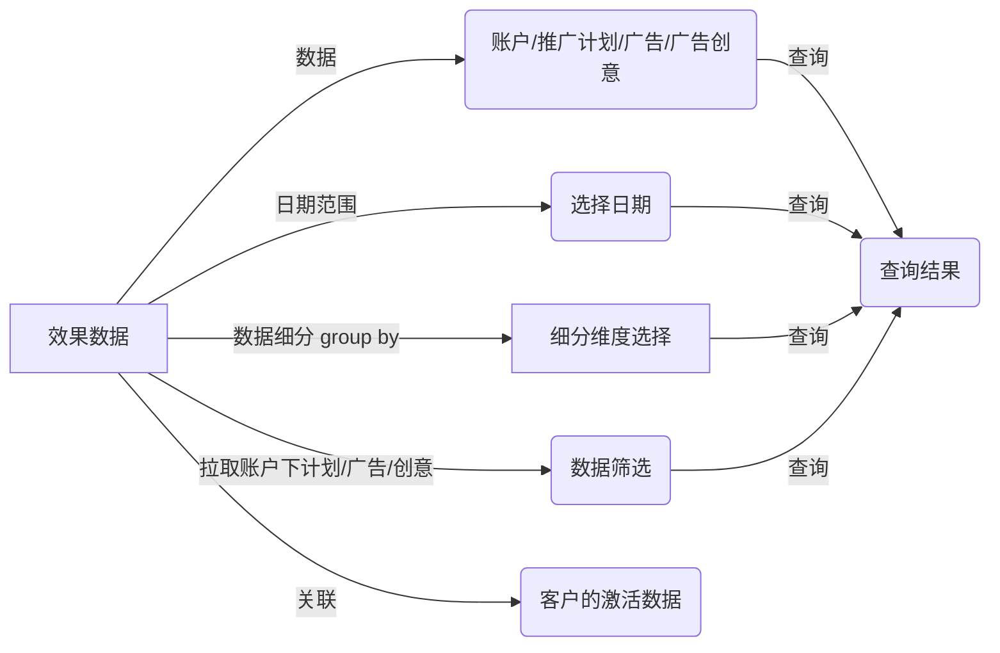

# Marketing API 聚合SDK

### 目标

AMS，巨量引擎等广告平台对外都提供marketing api做程序化投放，但是不同广告平台的api接口存在较大的差异，假如开发者需要做大量的适配工作才能对接多个广告平台。

聚合SDK希望对外提供**统一**的Marketing API接口，开发者只需要参考一份协议，就能完成对多个广告平台的对接。


## 方案

### 语言

第一版使用golang实现

### API接口抽象

这里截取部分接口定义

```golang
// MarketingSDK 统一对外的接口集合，包含多个子模块的接口
type MarketingSDK interface {
	Auth           // 权限
	ADDelivery     // 广告投放
	Account        // 账号
	Report         // 报表
	...
}

// Auth 权限
type Auth interface {
	GetToken(input *GetTokenInput) (*GetTokenOutput, error)
}

// ADDelivery 广告投放
type ADDelivery interface {
	BudgetOperation
	CampaignOperation
	ADGroupOperation
	CreativeOperation
}

// BudgetOperation 预算操作
type BudgetOperation interface {
	GetBudget(input *GetBudgetInput) (*GetBudgetOutput, error)
	UpdateBudget(input *UpdateBudgetInput) (*UpdateBudgetOutput, error)
}

...
```

## 样例
业务报表


接口定义：
```golang
// AMSMarketingSDK AMS marketing API实现
type AMSMarketingSDK struct {
    tClient *ads.SDKClient
}

// Name 名称
func (t *AMSMarketingSDK) Name() {
     return "AMS"
}

// NewAMSMarketingSDK constructor
func (t *AMSMarketingSDK) NewAMSMarketingSDK(sdkConfig *config.SDKConfig) {
    tClient := ads.Init(sdkConfig)
    tClient.UseProduction()
}


// DailyReports 获取天级别的广告数据
func (t *AMSMarketingSDK) DailyReports(input *marketingapi.DailyReportsInput) (*marketingapi.DailyReportsOutput, error) {
    // do something
}
```

请求参数定义：
```golang
package marketapi

import "github.com/antihax/optional"

// 广告报表请求的参数信息
type DailyReportsInput struct {
   ReportAdLevel         ReportAdLevel         `json:"level,omitempty"`            // 报表类型级别
   ReportTimeGranularity ReportTimeGranularity `json:"time_granularity,omitempty"` // 时间粒度
   ReportDateRange       ReportDateRange       `json:"data_range,omitempty"`       // 日期范围
   ReportFiltering       interface{}           `json:"filtering,omitempty"`        // 过滤条件
   ReportGroupBy         interface{}           `json:"groupby,omitempty"`          // 聚合条件
}

// 报表的类型级别
type ReportAdLevel string

const (
   LevelAccount  ReportAdLevel = "account"
   LevelCampaign ReportAdLevel = "campaign"
   LevelAd       ReportAdLevel = "ad"
   LevelCreative ReportAdLevel = "creative"
)

// 时间粒度
type ReportTimeGranularity string

const (
   TimeDaily ReportTimeGranularity = "daily"
   TimeHour  ReportTimeGranularity = "hour"
)

// 日期范围
type ReportDateRange struct {
   StartDate string `json:"start_date,omitempty"` // 开始日期
   EndDate   string `json:"end_date,omitempty"`   // 结束日期
}

// 过滤粒度
type ReportFiltering struct {
   // 共有
   CampaignIDList []string `json:"campaign_ids,omitempty"`  // 计划id列表
   GroupIDList    []string `json:"adgroup_id,omitempty"`    // 组id列表
   CreativeIDList []string `json:"creative_id,omitempty"`   // 广告创意id列表
   LandingTypes   []string `json:"landing_types,omitempty"` // 推广目的列表
   // Ocean
   InventoryTypes optional.Interface `json:"inventory_types,omitempty"`         // 投放版位
   PricingTypes   optional.Interface `json:"pricings,omitempty"`                // 出价类型
   ImageModes     optional.Interface `json:"image_modes,omitempty"`             // 素材类型列表
   CreativeMaterialModes optional.Interface `json:"creative_material_modes,omitempty"` // 创意类型列表
   FilterStatus    optional.Interface `json:"filter_status,omitempty"`           // 过滤状态：
}
```